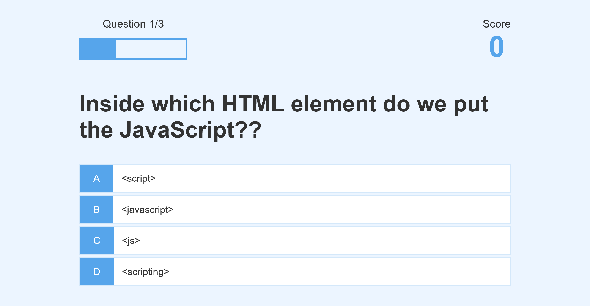

# QUIZZ APP

This a project from an UDEMY course where we built a quizz app alongside a teacher. It was fun, but I can't recommand such project because they give you the illusion of learning something...In reality you did understand a lot of thing, because you didn't exercises your mind enough through the problem and logic.

## Table of contents

- [Overview](#overview)
  - [The challenge](#the-challenge)
  - [Screenshot](#screenshot)
  - [Links](#links)
- [My process](#my-process)
  - [Built with](#built-with)
  - [What I learned](#what-i-learned)
  - [Continued development](#continued-development)
  - [Useful resources](#useful-resources)
- [Author](#author)

## Overview

### The challenge

- ES6 JavaScript features like arrow functions, the spread operator, const and let, and template literal string
- how to use the Fetch API to load trivia questions from an API
- how to store high scores in Local Storage
- how to use Flexbox, Animations, and REM units in CSS
- how to create a progress bar from scratch
- how to create a spinning loader icon from scratch
- Save high scores in Local Storage
- Create a spinning loader icon

### Screenshot



### Links

- Solution URL: [GitHub](https://github.com/Ryusaem/js-quizz-app)
- Live Site URL: [Github Live Demo](https://ryusaem.github.io/js-quizz-app/)

## My process

- My process was almost zero because I followed the instruction of the professor so I did not take the time to think about the application, the code, the logic yet.
- It is important for me to take the time to understand the process of my code, to be able to use it in different circumstances.

### Built with

- Semantic HTML5 markup
- CSS custom properties
- Flexbox
- Mobile-first workflow
- JavaScript

### What I learned

- progress BAR hud

```html
<div id="progressBar">
  <div id="progressBarFull"></div>
</div>
```

```css
#hud {
  display: flex;
  justify-content: space-between;
}

.hud-prefix {
  text-align: center;
  font-size: 2rem;
}

.hud-main-text {
  text-align: center;
}

#progressBar {
  width: 20rem;
  height: 4rem;
  border: 0.3rem solid #56a5eb;
  margin-top: 1.5rem;
}

#progressBarFull {
  height: 3.4rem;
  background-color: #56a5eb;
  width: 0%;
}
```

```js
//Update the progress bar progressBarFull.style.width =
`${(questionCounter / MAX_QUESTIONS) * 100}%`;
```

- linking website to different page

- using "data-....." attribute in HTML and using them in JS

- Delete element in an array using splice

```js
// it will target the index "questionIndex" and delete "1" number
availableQuesions.splice(questionIndex, 1);
```

- Using code snippet to gain time (I need to set that up)

process for fetch
Step-by-Step Process in Plain English:

    Get the Questions: Start by receiving a list of questions that have been loaded from an external API.

    Create a New List: For each question in the original list, create a new version that's formatted to suit the needs of the quiz app.

    Copy Incorrect Answers: Take the list of incorrect answers provided by the API and copy it into a new array.

    Determine Random Position for Correct Answer: Randomly decide where the correct answer will be placed among the incorrect answers (somewhere between the first and fourth position).

    Insert the Correct Answer: Add the correct answer into the randomly chosen position within the list of incorrect answers.

    Assign All Choices to the Question: Go through the list of all answers (now including the correct one at its new position) and assign each one to a property on the question object (like choice1, choice2, etc.).

    Complete the Question: Finish preparing the question by making sure it has both the question text and a structured list of answer choices.

    Repeat for All Questions: Do this for each question fetched from the API.

    Use the New List: The resulting list of formatted questions is now ready to be used in the quiz app to display questions and choices to the user.

This process ensures that each question from the API is reformatted with both the incorrect and correct answers mixed together in a random order, making the quiz fair and unpredictable.

### Continued development

- Continue the road of of learning more about API and fetch.
- Improve my understanding of object.
- Learning more to make my page as beautiful as he did, with high speed.

### Useful resources

- [GitHub Repository Course](https://github.com/jamesqquick/Build-A-Quiz-App-With-HTML-CSS-and-JavaScript) - The main repository of the course. You'll find all the necessary code
- [Project Link Udemy](https://www.udemy.com/course/build-a-quiz-app-with-html-css-and-javascript/) - This is the main link the the Udemy Project

## Author

- Github - [@Ryusaem](https://github.com/Ryusaem)
- Linkedin - [@sambath-meas](https://www.linkedin.com/in/sambath-meas)
- Coursera - [@sambath-meas](https://www.coursera.org/learner/sambath-meas)
- Twitter - [@RyuBraveheart](https://twitter.com/RyuBraveheart)
- Frontend Mentor - [@Ryusaem](https://www.frontendmentor.io/profile/Ryusaem)
- CodeWars - [@Ryusaem](https://www.codewars.com/users/Ryusaem)
